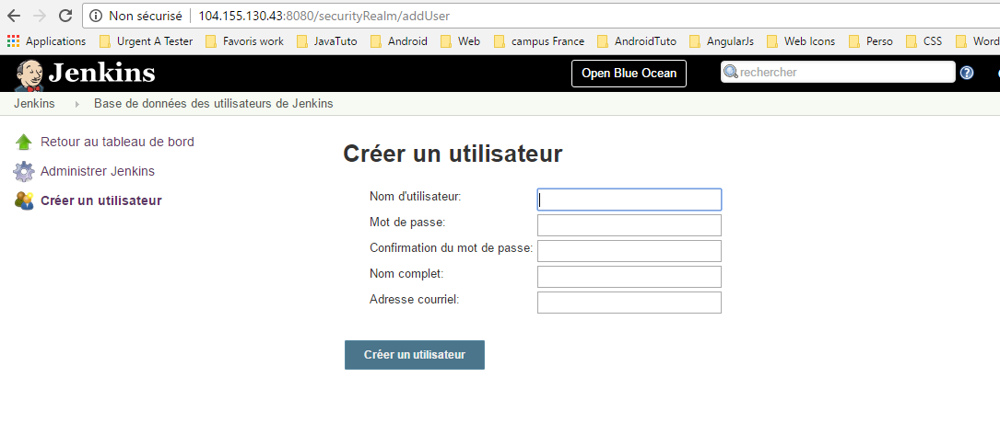
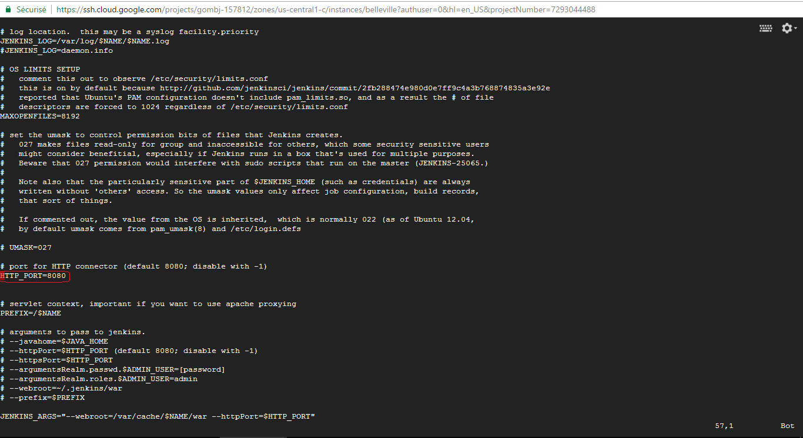

# Qu'est ce que Jenkins ?
Jenkins est un outil open source [d'intégration continue](https://fr.wikipedia.org/wiki/Int%C3%A9gration_continue "lien vers wikipedia") développé en Java.

# Installation de Jenkins
Jenkins est une application web Java et pour l'installation, il est possible de la déployer sur un container de servlet tel que Apache Tomcat. Mais il est également possible d'installer Jenkins de manière autonome sous forme de service Linux. C'est cette dernière solution que nous avons adoptée car nous paraissant plus simple et efficace.

## Configurer la communication entre notre machine Linux et le repo de Jenkins

 wget -q -O - https://pkg.jenkins.io/debian-stable/jenkins.io.key | sudo apt-key add -


## Ajouter le repo de Jenkins dans la liste des repo de notre machine Linux

deb https://pkg.jenkins.io/debian-stable binary/


## Mettre à jour le système et installer le "paquet jenkins"


sudo apt-get update
sudo apt-get install jenkins


## Demarrer Jenkins
Nous venons d'installer Jenkins comme un service Linux; Ceci peut se vérifier en consultant le contenu du dossier /etc/init.d/

 ls -la /etc/init.d/


Nous pouvons désormais démarrer et stoper jenkins  comme un servicce


 sudo /etc/init.d/jenkins start
 sudo /etc/init.d/jenkins stop


La webapp Jenkins est ainsi démarré en HTTP sur le port 8080.

## Première connection

A cette étape il faut se connecter avec le mode de passe par défaut envoyé par jenkins

# Configuration de Jenkins

## Ajout des comptes utilisateurs

## Modification du port
Pour le faire il faut ouvrir le fichier /etc/default/jenkins avec la commande :

sudo vi /etc/default/jenkins


Maintenant aller jusqu'au niveau de *HTTP_PORT* et changer la valeur.

## Authentification sur le repository
Chez QANBIO, nos repos sont hébergés sur Bitbucket. Il s'agit donc de mettre au user Jenkins depuis la machine de CI cloner le projet à chaque build. Cette opération se passe en deux temps :
* Génération des clés SSH pour le user Jenkins
* Ajout de la clé publique du user Jenkins sur Bitbucket
* Configuration de Jenkins pour lui indiquer avec quelle clé privée il doit communiquer avec Bitbucket

### Générations des clés SSH

$ sudo -i -u jenkins
ssh-keygen -t rsa -b 4096 -C "Jenkins"


### Ajout de la clé publique du user Jenkins sur Bitbucket

#Todo : insérer une commande ici


### Configuration de Jenkins pour lui indiquer avec quelle clé privée il doit communiquer avec Bitbucket

#Todo : insérer une commande ici


# Tester la configuration : création d'un Job qui build et teste notre projet

Todo : captures d'écran
